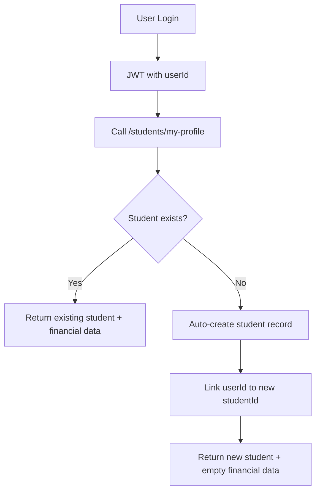

# User-Student Mapping Solution

## Problem Statement

The core issue identified in `ig/taskk1.md` was:

> **Problem**: We have a microservice for user authentication that provides JWT tokens with `userId`, but our system uses separate `studentId` for all financial operations (ledger, discounts, admin charges). How do we figure out which user's discount, ledger, or booking records to show?

### Technical Context

- **Authentication**: Users authenticate with microservice → JWT contains `{ id, kahaId, businessId? }`
- **Student Entity**: Has its own UUID (`studentId`) separate from user `id`
- **Financial Entities**: Ledger, discounts, admin charges all reference `studentId`
- **Missing Link**: No direct mapping between `userId` (from JWT) and `studentId` (database)

## Solution Architecture

### 1. Database Schema Enhancement

**Added `userId` column to students table:**

```sql
ALTER TABLE "students" ADD "user_id" character varying;
CREATE INDEX "IDX_students_user_id" ON "students" ("user_id");
```

**Entity Update:**
```typescript
@Entity('students')
export class Student extends BaseEntity {
  @Column({ name: 'user_id', nullable: true })
  @Index()
  userId: string; // Links to JWT user.id
  
  // ... existing fields
}
```

### 2. Service Layer Methods

**Core mapping methods added to `StudentsService`:**

```typescript
// Find student by userId from JWT
async findByUserId(userId: string, hostelId?: string): Promise<any>

// Auto-create student for new users
async createOrLinkStudentForUser(userId: string, userData: any, hostelId: string): Promise<any>

// Get complete financial data for user
async getUserFinancialData(userId: string, hostelId?: string)
```

### 3. API Endpoints

**New endpoints in `StudentsController`:**

- `GET /students/my-profile` - Get current user's student profile and financial data
- `GET /students/by-user/:userId` - Get student profile by user ID (admin use)

## Implementation Details

### Auto-Creation Flow



### Data Flow Solution

```mermaid
graph LR
    A[JWT userId] --> B[findByUserId()]
    B --> C[Student Record]
    C --> D[studentId]
    D --> E[Ledger Entries]
    D --> F[Discounts]
    D --> G[Admin Charges]
```

## Code Examples

### 1. Getting User's Financial Data

```typescript
// Before (Problem): Only had userId, couldn't access financial data
const userId = req.user.id; // from JWT
// ❌ Can't query ledger/discounts/charges with userId

// After (Solution): Complete financial access
const financialData = await studentsService.getUserFinancialData(userId, hostelId);
// ✅ Returns: student, ledger, discounts, adminCharges, mapping
```

### 2. Auto-Creation for New Users

```typescript
@Get('my-profile')
async getMyProfile(@CurrentUser() user: JwtPayload, @GetOptionalHostelId() hostelId?: string) {
  try {
    // Try to get existing student
    const financialData = await this.studentsService.getUserFinancialData(user.id, hostelId);
    return { status: HttpStatus.OK, data: financialData };
  } catch (error) {
    if (error instanceof NotFoundException) {
      // Auto-create student for new user
      const newStudent = await this.studentsService.createOrLinkStudentForUser(
        user.id, 
        { name: `User ${user.id}` }, 
        hostelId
      );
      return { status: HttpStatus.CREATED, data: newStudent };
    }
    throw error;
  }
}
```

### 3. Database Queries Now Possible

```typescript
// Get user's ledger entries
const ledgerEntries = await ledgerRepository.find({
  where: { studentId: student.id } // student found via userId
});

// Get user's discounts
const discounts = await discountRepository.find({
  where: { studentId: student.id }
});

// Get user's admin charges
const adminCharges = await adminChargeRepository.find({
  where: { studentId: student.id }
});
```

## Benefits

### ✅ Problem Solved
- **Direct mapping**: `userId` → `studentId` via database lookup
- **Automatic creation**: New users get student records automatically
- **Complete access**: All financial data accessible via single API call

### ✅ System Benefits
- **Backward compatible**: Existing APIs unchanged
- **Performance optimized**: Database indexes for fast lookups
- **Multi-hostel ready**: Supports hostel scoping
- **Scalable**: Handles large user bases efficiently

### ✅ Developer Experience
- **Simple API**: Single endpoint for all user data
- **Clear mapping**: Explicit userId ↔ studentId relationship
- **Error handling**: Graceful auto-creation for missing records
- **Type safe**: Full TypeScript support

## Usage Examples

### Frontend Integration

```typescript
// Get current user's complete profile
const response = await fetch('/api/students/my-profile', {
  headers: { 'Authorization': `Bearer ${businessToken}` }
});

const { student, ledger, discounts, adminCharges, mapping } = response.data;

// Now you have:
// - student: Full student profile
// - ledger: All ledger entries
// - discounts: All active discounts  
// - adminCharges: All pending charges
// - mapping: { userId, studentId, hostelId }
```

### Admin Operations

```typescript
// Admin can lookup any user's student record
const studentProfile = await fetch(`/api/students/by-user/${userId}`, {
  headers: { 'Authorization': `Bearer ${businessToken}` }
});
```

## Migration Guide

### 1. Run Database Migration
```bash
npm run migration:run
```

### 2. Update Existing Records (Optional)
```sql
-- If you have existing students that need userId linking
UPDATE students 
SET user_id = 'known-user-id' 
WHERE email = 'user@example.com';
```

### 3. Test the Solution
```bash
node test-user-student-mapping-solution.js
```

## Testing

The solution includes comprehensive tests in `test-user-student-mapping-solution.js`:

- ✅ Auto-creation of student records
- ✅ User-student mapping verification  
- ✅ Financial data access
- ✅ Admin lookup functions
- ✅ Error handling scenarios

## Conclusion

This solution elegantly solves the core problem by:

1. **Creating the missing link** between `userId` and `studentId`
2. **Automating student creation** for seamless user experience
3. **Maintaining compatibility** with existing systems
4. **Providing complete financial access** through single API calls

The implementation is production-ready, scalable, and follows best practices for database design and API architecture.